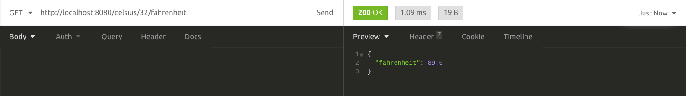
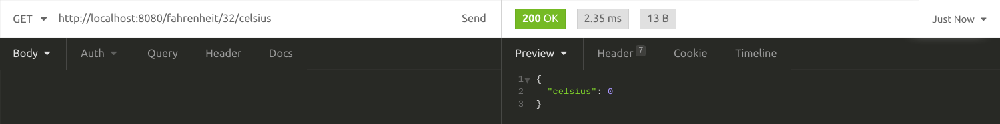

# 🌱 Descrição do projeto 
- Api para converter de celsius para fahrenheit e fahrenheit para celsius

## Clonando o projeto 

    $ git clone git@github.com:leoviana00/api-conversao-nodejs.git

## Rodando o app

    $ node index.js

## Testanto o programa

    - http://localhost:8080/celsius/0/fahrenheit
    - http://localhost:8080/fahrenheit/0/celsius

- Celsius para fahrenheit



- Fahrenheit para celsius



## Dockerizando o app

```
FROM node:15-alpine

WORKDIR /app
COPY package*.json ./
RUN npm install
COPY . .
EXPOSE 8080
CMD ["node", "index.js"]
```
## Build

    $ docker build -t leoviana00/api-conversao:v1 .

## Push

    $ docker push leoviana00/api-conversao:v1

## Pull

    $ docker pull leoviana00/api-conversao:v1

## Run

    $ docker container run -d -p 8080:8080 leoviana00/api-conversao:v1
  

## Docker Hub

- https://hub.docker.com/r/leoviana00/api-conversao

``` 
➜ docker container ls

CONTAINER ID        IMAGE                         COMMAND                  CREATED             STATUS              PORTS                    NAMES
4f0b5093e89a        leoviana00/api-conversao:v1   "docker-entrypoint.s…"   10 minutes ago      Up 10 minutes       0.0.0.0:8080->8080/tcp   serene_mclaren
```